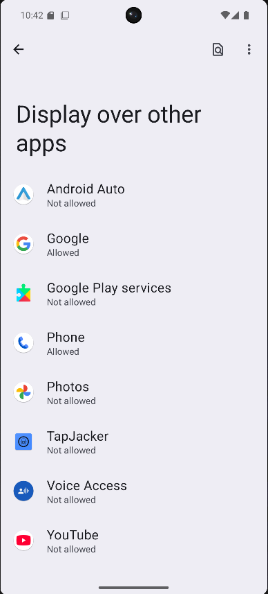
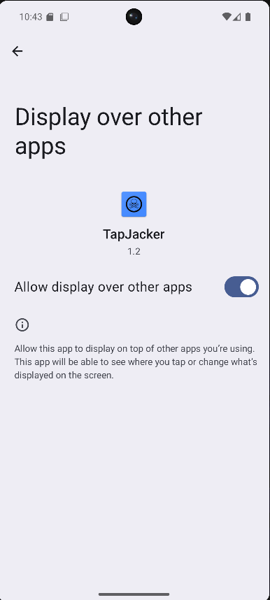
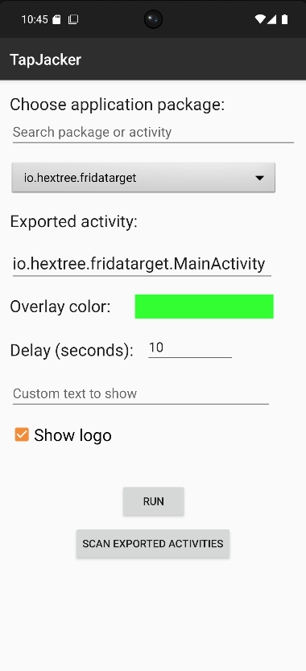
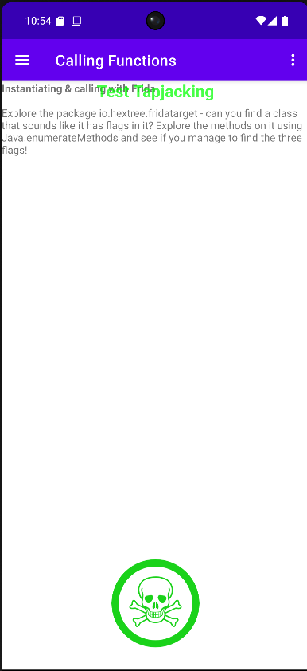

# TapJacker

TapJacker est une application Android conçue pour **démontrer et tester les vulnérabilités de type Tapjacking** dans les applications mobiles.

Le projet a été développé dans un objectif de **recherche en sécurité mobile, d’apprentissage et de tests d’intrusion autorisés**.

⚠️ Cet outil doit être utilisé **uniquement dans un cadre légal et autorisé**.

---

# Qu'est-ce que le Tapjacking ?

Le **Tapjacking** est une attaque de type **UI redressing** où une application malveillante affiche un **overlay** au-dessus d'une autre application afin de tromper l'utilisateur.

L’utilisateur croit cliquer sur un élément visible alors qu’il interagit en réalité avec une action située **dans l’application en arrière-plan**.

Cette attaque peut permettre par exemple :

* d’activer des permissions sensibles
* de lancer des activités internes d’une application
* de modifier des paramètres
* de déclencher des actions à l’insu de l’utilisateur

TapJacker permet de **simuler ce type d’attaque dans un environnement de test**.

---

# Fonctionnalités

* affichage d’un **overlay Android personnalisable**
* sélection d’une **application cible**
* sélection d’une **activité exportée**
* scan automatique des **exported activities**
* recherche dans les packages installés
* personnalisation de l’overlay

  * couleur
  * texte
  * logo
* délai configurable avant l’attaque
* démonstration visuelle du Tapjacking

---

# Fonctionnement technique

## 1. Récupération des applications installées

L’application utilise `PackageManager` pour récupérer toutes les applications installées sur l’appareil afin de permettre à l’utilisateur de sélectionner une cible.

---

## 2. Scan des activités exportées

TapJacker peut analyser les applications installées et identifier les **activités exportées** accessibles par d’autres applications.

Ces activités sont des **points d’entrée potentiels** exploitables.

---

## 3. Création de l’overlay

L’application utilise le `WindowManager` Android pour afficher un overlay couvrant l’écran :

```java
WindowManager.LayoutParams.TYPE_APPLICATION_OVERLAY
```

L’overlay est configuré pour :

* couvrir l’écran
* rester visible au-dessus des autres applications
* masquer les interactions réelles

---

## 4. Permissions Android utilisées

L’application nécessite les permissions suivantes :

```xml
<uses-permission android:name="android.permission.SYSTEM_ALERT_WINDOW"/>
```

Permet d’afficher un overlay au-dessus des autres applications.

```xml
<uses-permission android:name="android.permission.QUERY_ALL_PACKAGES"/>
```

Permet de lister les applications installées.

---

## 5. Lancement de l’activité cible

Une fois l’overlay affiché, l’application lance l’activité cible avec un `Intent` :

```java
Intent intent = new Intent();
intent.setComponent(new ComponentName(packageName, activityName));
intent.setFlags(Intent.FLAG_ACTIVITY_NEW_TASK);
startActivity(intent);
```

Cela permet de déclencher une action dans l’application cible pendant que l’utilisateur voit uniquement l’overlay.

---

# Interface utilisateur

L’interface permet de configurer plusieurs paramètres :

* recherche d’application
* sélection du package cible
* sélection d’une activité exportée
* choix de la couleur de l’overlay
* délai avant exécution
* texte personnalisé
* affichage du logo

---
## Démonstration (pas à pas)

Cette démonstration montre comment utiliser **TapJacker** pour illustrer une attaque de type **Tapjacking** dans un environnement de test.

### 1) Autoriser l’affichage par-dessus les autres applications (Overlay)

1. Ouvre les paramètres Android : **Display over other apps**  
2. Trouve **TapJacker** dans la liste  
3. Active **Allow display over other apps**




> Sans cette permission (`SYSTEM_ALERT_WINDOW`), TapJacker ne peut pas afficher l’overlay.

---

### 2) Choisir la cible

1. Ouvre **TapJacker**
2. Dans **Choose application package**, sélectionne l’application cible (ou utilise la barre de recherche)

Dans cet exemple, la cible est une application volontairement vulnérable utilisée pour l’apprentissage du pentest Android :

- **Hextree Frida Target** : `io.hextree.fridatarget`

---

### 3) Configurer l’attaque

Dans TapJacker :

- **Exported activity** : sélectionner / renseigner l’activité cible  
- **Overlay color** : choisir une couleur  
- **Delay (seconds)** : définir le délai (ex. `10`)  
- **Custom text to show** : mettre un texte (optionnel)  
- **Show logo** : afficher / masquer le logo



---

### 4) Lancer la démonstration

1. Clique sur **RUN**
2. TapJacker affiche un overlay et lance l’activité cible
3. L’overlay masque l’interface réelle de l’application cible pendant la durée du délai



---

## Notes

- Le bouton **SCAN EXPORTED ACTIVITIES** liste les activités `exported=true` des applications installées pour faciliter la sélection d’une cible.
- Cette démonstration est réalisée à des fins **éducatives** et de **pentest autorisé**.

---

# Installation

## Cloner le projet

```bash
git clone https://github.com/z3dxian6/Tapjacker.git
```

---

## Ouvrir avec Android Studio

1. ouvrir Android Studio
2. sélectionner **Open Project**
3. choisir le dossier `TapJacker`
4. construire le projet

---

## Installer l’application

Compiler le projet et installer l’APK sur un appareil Android ou un émulateur.

---

# Contre-mesures contre le Tapjacking

Les développeurs Android peuvent se protéger contre cette attaque en utilisant :

```java
setFilterTouchesWhenObscured(true);
```

ou en vérifiant si une vue est obscurcie :

```java
View.isObscured()
```

Autres protections possibles :

* éviter les activités exportées inutiles
* vérifier l’origine des intents
* utiliser `FLAG_SECURE`
* détecter les overlays

---

# Structure du projet

```
TapJacker
│
├── app
│   ├── src
│   │   ├── main
│   │   │   ├── java/com/zed/tapjacker
│   │   │   │   └── MainActivity.java
│   │   │   ├── res/layout
│   │   │   │   ├── activity_main.xml
│   │   │   │   └── tapjacker_overlay.xml
│   │   │   └── AndroidManifest.xml
│
├── misc
│   ├── main_activity.png
│   └── tapjacking_demo.png
│
├── README.md
└── LICENSE
```

---

# Avertissement légal

Ce projet est destiné uniquement à :

* la recherche en sécurité
* l’apprentissage de la sécurité Android
* les tests d’intrusion autorisés

Toute utilisation contre un système sans autorisation explicite peut être illégale.

---

# Auteur

**Zoran**
Mobile Security • Pentesting
